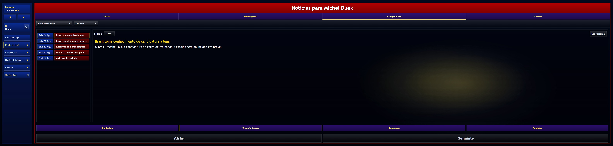

# SimuladorNews - Layout Refactor



## Sobre o Projeto

Este projeto é uma refatoração completa e modernização do **SimuladorNews**, migrando de uma estrutura legada (HTML/CSS/JS monolítico) para uma arquitetura moderna baseada em **Vite**, **TypeScript** e **Componentes Modulares**.

O objetivo foi manter a identidade visual original (réplica de interface de jogo de gestão de futebol) enquanto se aprimora a manutenibilidade, escalabilidade e a experiência de desenvolvimento.

## ✨ Funcionalidades e Melhorias

*   **Arquitetura Moderna**: Utiliza Vite para um ambiente de desenvolvimento ultra-rápido e builds otimizados.
*   **TypeScript**: Código totalmente tipado, garantindo maior segurança e menos erros em tempo de execução.
*   **Componentização**: A interface foi dividida em componentes reutilizáveis (Sidebar, Toolbar, NewsList, etc.).
*   **CSS Modular**: Estilos organizados por componente/funcionalidade em `src/styles`, facilitando a manutenção.
*   **Gestão de Estado**: Implementação de Serviços (`StateService`, `StorageService`) para gerenciar dados e persistência local.

## 📂 Estrutura do Projeto

```
SimuladorNews/
├── public/              # Arquivos estáticos (index.html, imagens)
├── src/
│   ├── components/      # Componentes da UI (Sidebar, Toolbar, etc.)
│   ├── data/            # Dados estáticos/mock (newsData.ts)
│   ├── models/          # Interfaces e tipos TypeScript (News, User)
│   ├── services/        # Lógica de negócio e estado (StateService)
│   ├── styles/          # CSS modular (layout.css, sidebar.css, etc.)
│   ├── utils/           # Funções utilitárias
│   ├── app.ts           # Controlador principal da aplicação
│   └── main.ts          # Ponto de entrada (entry point)
├── package.json         # Dependências e scripts
├── tsconfig.json        # Configuração do TypeScript
└── vite.config.ts       # Configuração do Vite
```

## 🚀 Como Executar

Certifique-se de ter o [Node.js](https://nodejs.org/) instalado.

1.  **Instale as dependências**:
    ```bash
    npm install
    ```

2.  **Inicie o servidor de desenvolvimento**:
    ```bash
    npm run dev
    ```

3.  **Acesse no navegador**:
    O terminal exibirá o link local (geralmente `http://localhost:5173/`).

## 🛠️ Tecnologias Utilizadas

*   [Vite](https://vitejs.dev/) - Build tool e Dev Server.
*   [TypeScript](https://www.typescriptlang.org/) - Linguagem.
*   HTML5 & CSS3 - Estrutura e Estilização (Vanilla).

---
*Refatorado com foco em performance e organização de código.*
